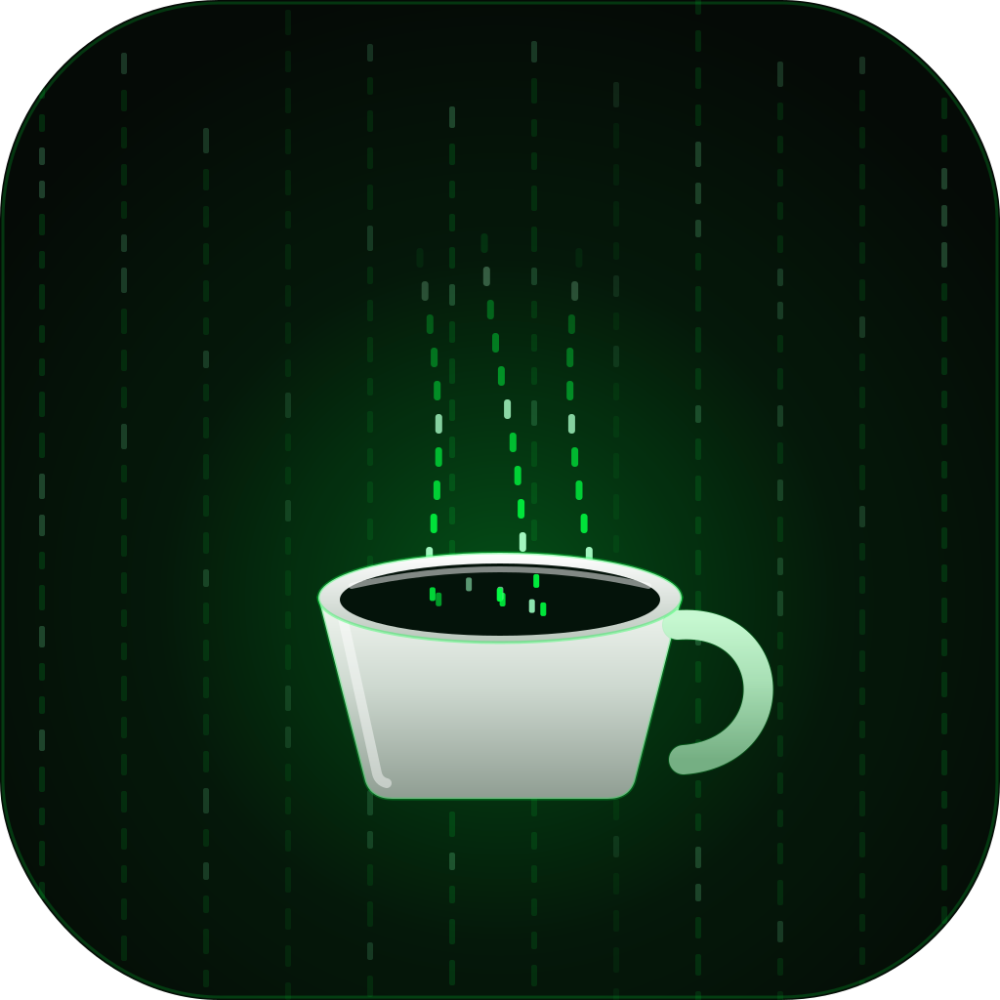

<div align="center">



# Caffeinatrix

**The screen stays awake. Your jobs keep running. The rain keeps falling.**

A fullscreen Matrix rain that keeps your Mac or PC from sleeping while long
builds, training runs, or overnight prompts grind away. Named for the macOS
`caffeinate` command it replaces, dressed up in green.

</div>

```
ﾊ 7 ｱ │ wake state: ON   │ display sleep: BLOCKED   │ vibe: immaculate
```

## What it does

Launch it, and your machine renders an endless cascade of green code at
fullscreen while holding the display awake. Close it, and your power settings
go right back to normal. Nothing to remember to turn off, no terminal window
to babysit.

Under the hood it asks the OS to block display sleep (Electron's
`powerSaveBlocker` in `prevent-display-sleep` mode), so the screen stays lit
and your background work never gets paused.

**Easy on the panel.** Every pixel is in constant motion, so there is nothing
static to burn into an OLED or mini-LED display over a long overnight session.
The rain is the screen saver and the keep-awake at the same time.

## Run it from source

```bash
npm install
npm start
```

That is enough to use it nightly. Leave it running, kill it in the morning.

### Controls

| Key | Action |
| --- | --- |
| `Esc` | quit |
| `Cmd/Ctrl + Q` | quit |
| `F` | toggle fullscreen |

## Build the installers

The project is wired for `electron-builder`. Build each installer on its own
platform (Apple's tooling makes a real `.dmg` only on macOS, and the Windows
installer wants Windows or Wine).

```bash
# on your Mac  ->  release/Caffeinatrix-1.0.0.dmg
npm run dist:mac

# on your PC   ->  release/Caffeinatrix Setup 1.0.0.exe
npm run dist:win
```

Output lands in `release/`. The Windows build is a standard NSIS installer
(pick the folder, gets a desktop + Start Menu shortcut). The Mac build is a
drag-to-Applications `.dmg`. App icons are already generated in `build/`
(`icon.icns`, `icon.ico`, `icon.png`), so the installed app and desktop
shortcut carry the coffee-cup logo.

> Unsigned builds will trip Gatekeeper on macOS and SmartScreen on Windows the
> first time. For personal use just right-click open (Mac) or choose "More info
> -> Run anyway" (Windows). Code signing is optional and only matters if you
> distribute it.

## Make it yours

Everything lives in `renderer.js` near the top:

```js
const FONT_SIZE = 18;     // glyph size
const HEAD = '#cfffd0';   // leading glyph color
const BODY = '#00ff41';   // trail color (classic matrix green)
const FPS  = 26;          // frame cap (lower = cooler/quieter laptop)
```

Drop `FPS` for an even calmer overnight burn, bump `FONT_SIZE` for chunkier
glyphs, or swap the greens for amber if you want the old-terminal look. The
glyph set is half-width katakana plus digits; edit the `GLYPHS` builder to
change the alphabet.

## Logo

`assets/logo.svg` is the source of truth: a coffee cup whose steam is the code,
brewed in matrix green. Regenerate the raster icons any time with
`python3 build_logo.py` followed by the icon export in this repo's history.

## License

MIT. Do whatever you like with it.
